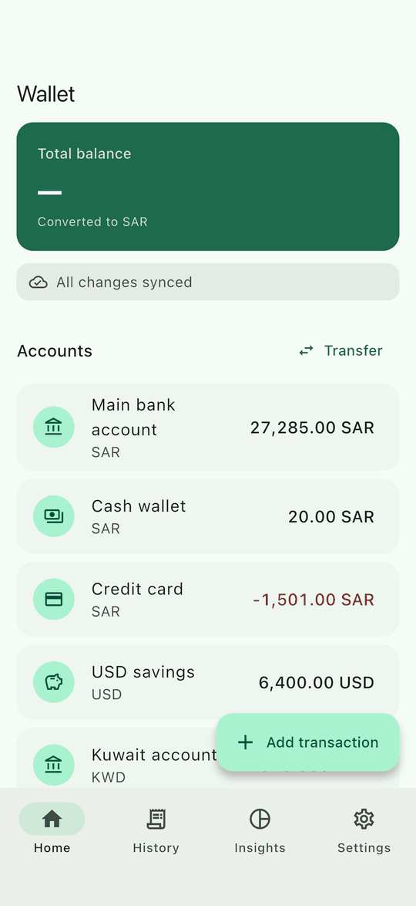
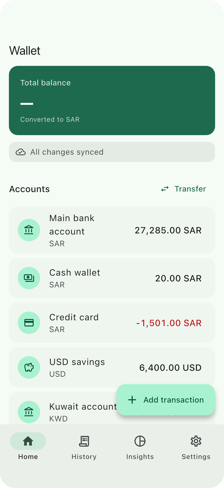
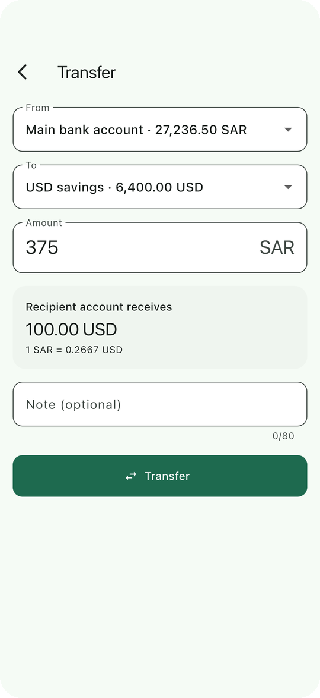
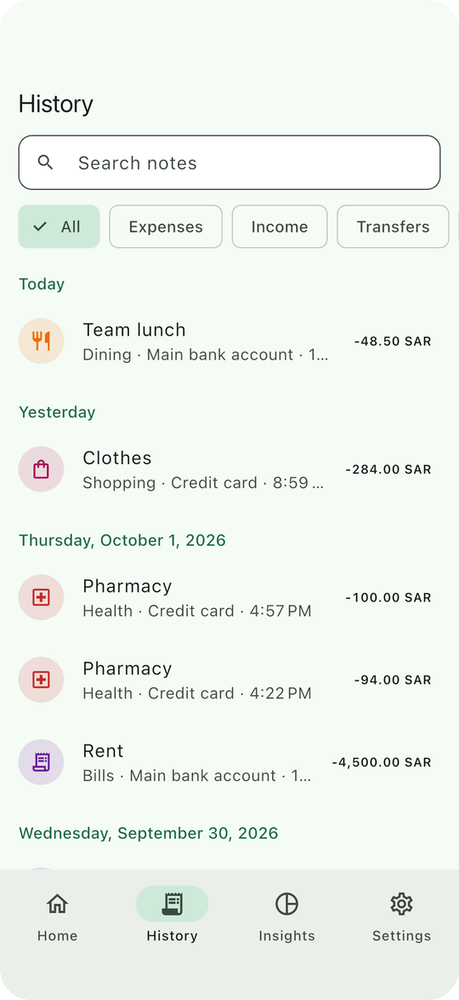
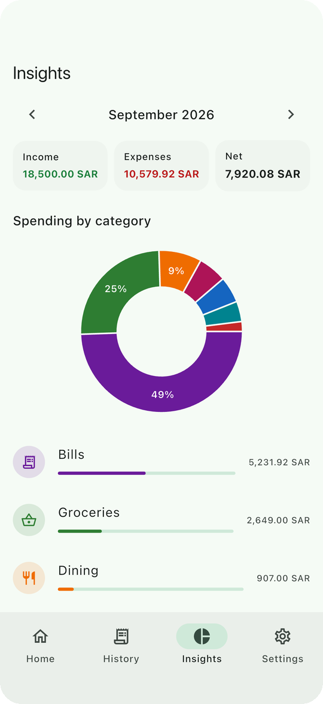
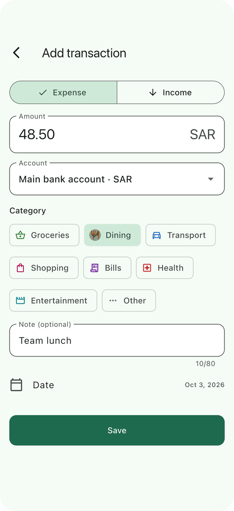
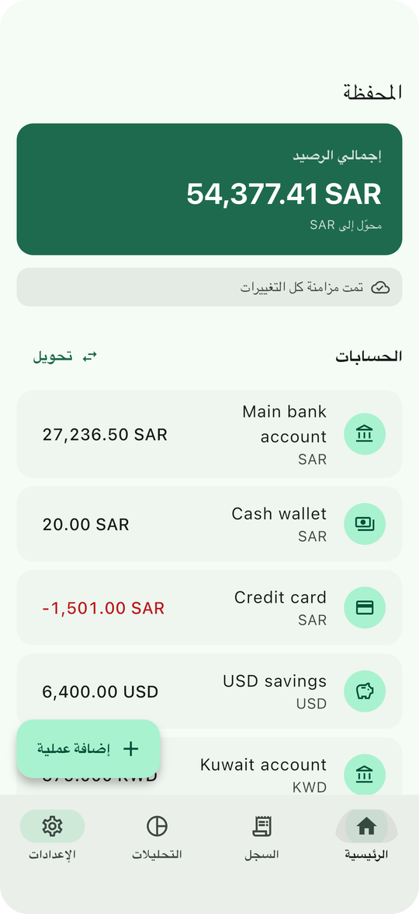

# Flutter Fintech Wallet

[](https://github.com/mokinan/flutter-fintech-wallet/actions/workflows/ci.yml)

An offline-first, multi-currency wallet built with Flutter. It is designed
around the problems that actually break financial apps: exact money
arithmetic, safe retries on unreliable networks, and on-device security.

<p align="center">
  
  
  
</p>

## Highlights

**Exact money handling.** Amounts are integer minor units with ISO 4217
precision (SAR 2, KWD 3, JPY 0). Input with too many decimals is rejected,
never rounded. FX conversion is a single exact `BigInt` fraction, rounded once.
→ [ADR 1](docs/adr/0001-money-as-integer-minor-units.md)

**Offline-first.** SQLite (Drift) is the source of truth. Every screen is a
reactive query, and writes appear instantly, marked *waiting to sync*.
→ [ADR 2](docs/adr/0002-local-database-as-source-of-truth.md)

**No duplicate payments.** Writes go to a transactional outbox and are sent
with an `Idempotency-Key`. The tests drop 100% of server responses and still
end up with exactly one record. Ordered draining, exponential backoff with
jitter, and permanent vs. transient failure handling are included.
→ [ADR 3](docs/adr/0003-idempotent-outbox-sync.md)

**Robust auth.** Rotating refresh tokens with a **single-flight** refresh: five
concurrent 401s cause one refresh, and all five requests replay. A network blip
during refresh does not log the user out.

**App lock.** A salted, iterated PIN hash with an attempt limit that persists
across restarts, optional biometrics, auto-lock after 30 s in the background,
an app-switcher privacy cover, and `FLAG_SECURE` on Android.
→ [ADR 5](docs/adr/0005-result-type-and-session-security.md)

**Arabic & English** with full RTL, plural rules, and Arabic-Indic digit input.

## Try the failure modes yourself

The app ships with an **in-process fake backend**, plugged in as a Dio
`HttpClientAdapter`, so the real interceptors, retries and error mapping all
run. *Settings → Developer tools* lets you:

| Switch | What you'll see |
|---|---|
| Simulate offline | Writes are saved locally and the banner counts them; they sync on reconnect |
| Flaky network | 30% of requests return 503; the outbox backs off and retries |
| Lose responses | The server commits, but the client times out; the retry is deduplicated by idempotency key |
| Expire access token | The next request triggers a transparent refresh |

Demo login: `demo@wallet.dev` / `Demo1234` (or tap *Use demo account*).

## Architecture

```
lib/
├── app/            # composition root (get_it), router, theme
├── core/           # Money, Result/Failure, database, network, security
└── features/
    ├── accounts/   # balances (derived in SQL), demo data
    ├── auth/       # login, PIN, biometrics, session & lock lifecycle
    ├── transactions/
    ├── transfers/
    ├── insights/
    ├── rates/      # FX cache with TTL and stale fallback
    ├── sync/       # outbox writer, sync engine, status
    └── settings/
```

Each feature is split into `domain` (entities, repository contracts),
`data` (Drift / Dio implementations) and `presentation` (Bloc + widgets).

```
Widget → Cubit/Bloc → Repository (interface)
                          │
                          ▼
              Drift transaction ─┬─ domain rows
                                 └─ outbox entry ──► SyncEngine ──► Dio (+ AuthInterceptor) ──► API
```

| Concern | Choice |
|---|---|
| State | `flutter_bloc`, with `bloc_concurrency` for debounced/restartable search and droppable pagination |
| Navigation | `go_router`; redirects are a pure function of the session state |
| Storage | Drift (SQLite) with reactive queries |
| Networking | Dio with an auth interceptor |
| Secrets | `flutter_secure_storage` (Keychain / Keystore) |
| DI | `get_it`, used only in the composition root |

The reasoning behind each choice, and what was deliberately left out, is in
[`docs/adr`](docs/adr).

## Testing

```bash
flutter test                       # 81 unit, bloc and widget tests
flutter drive \
  --driver=test_driver/integration_test.dart \
  --target=integration_test/app_test.dart   # end-to-end on a device or simulator
```

| Area | Examples of what is verified |
|---|---|
| Money | rounding, precision per currency, cross rates, no `double` precision loss |
| Sync engine | idempotent retry after a lost response, ordered delete-after-create, backoff, permanent rejection |
| Auth | single-flight refresh under concurrency, revoked refresh token, network failure during refresh |
| Repositories | keyset pagination with equal timestamps, filters, LIKE escaping, atomic transfers, overdraft rules |
| Session | PIN lockout and wipe, biometric cancel, auto-lock timing, expired session keeps data |
| UI | currency-specific validation, RTL layout |
| End-to-end | sign in → create PIN → add expense offline → reconnect → verify the server has exactly one record |

The screenshots in this README are produced by the end-to-end test.

## CI

Every push runs format check, `flutter analyze --fatal-infos`
(`very_good_analysis`), the test suite with an **80% coverage gate on
business logic**, and an Android build whose APK is uploaded as an artifact.

## Running locally

```bash
flutter pub get
dart run build_runner build --delete-conflicting-outputs
flutter run
```

Requires Flutter 3.35+.

## Screens

<p align="center">
  
  
  
  
</p>

## License

MIT
